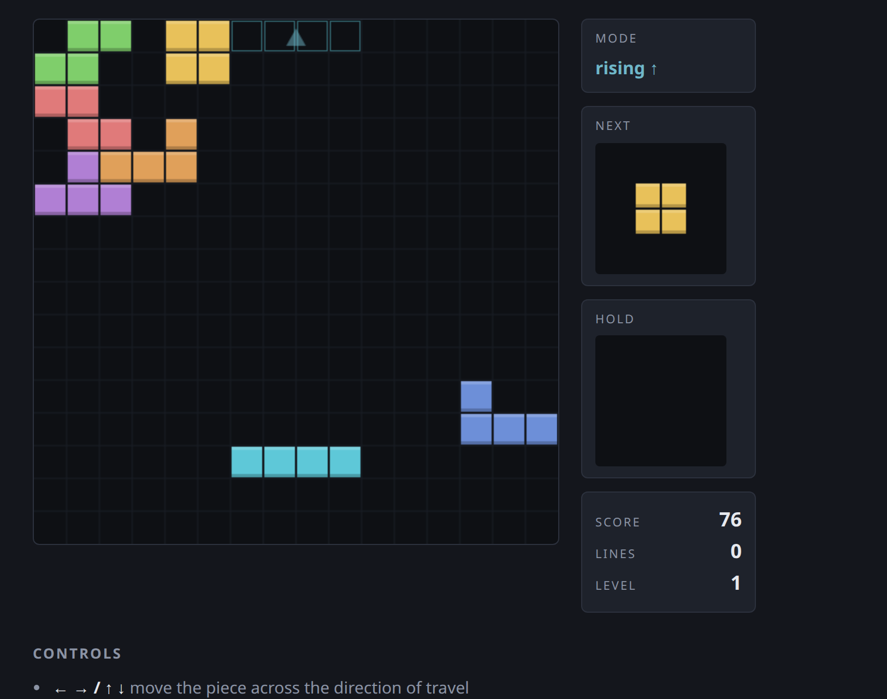

# sirtetris



A symmetric stacking puzzle. Pieces don't only fall — they **alternate**:

- **Vertical mode** — the piece rises from the floor to the ceiling.
- **Horizontal mode** — the piece slides in from the right or the left
  (the side alternates each time).

Every time a piece locks, **any full row and any full column clears**. The
gap left by a cleared row collapses toward the ceiling; the gap left by a
cleared column collapses toward the wall the piece came from.

The two modes take turns, so the playfield is a square and every rule has a
mirror image. A hole you leave in one mode becomes a wall you fight in the
next.

## Play

Open `index.html` in any modern browser. No build step, no dependencies.

```
python3 -m http.server   # then visit http://localhost:8000
```

## Controls

| Key | Action |
| --- | --- |
| `←` `→` / `↑` `↓` | move the piece *across* its direction of travel |
| arrow pointing at the wall | soft drop |
| `Space` | hard drop |
| `Z` / `X` | rotate |
| `C` | hold |
| `P` | pause · `R` restart |

In vertical mode the wall is the ceiling, so `↑` soft-drops and `← →`
strafe. In horizontal mode the wall is a side, so that side's arrow
soft-drops and `↑ ↓` strafe.

## Scoring

Clearing `n` lines (rows + columns) at once scores `50 · n · (n + 1)` times
the current level, so combined clears are worth chasing. Level rises every
10 lines and the pieces move faster.

## Deployment

Pushing to `main` triggers `.github/workflows/deploy.yml`, which stages the
three static files and `rsync`s them to
`www.andrew-tremblay.com/games/sirtetris/` over SSH. It needs three repo
secrets — `SSH_HOST`, `SSH_USERNAME`, `SSH_PASSWORD` — the same ones the
sibling `puzzle-arcade` deploy uses.

## Originality / licensing

This is an independent implementation written from scratch.

- No third-party code, art, fonts, or sound is used or bundled.
- The seven tetrominoes are the complete set of four-cell polyominoes — a
  mathematical fact, not a copyrightable work. The colours, board
  dimensions, timing curve, scoring table, rendering, and the
  alternating-gravity rule are all original to this project.
- "Tetris" is a registered trademark of The Tetris Company. This project
  is not affiliated with, endorsed by, or derived from that product;
  "sirtetris" is used here as a project code name. Rename it before any
  public or commercial release if that could cause confusion.

Released under the MIT License (see `LICENSE`).
